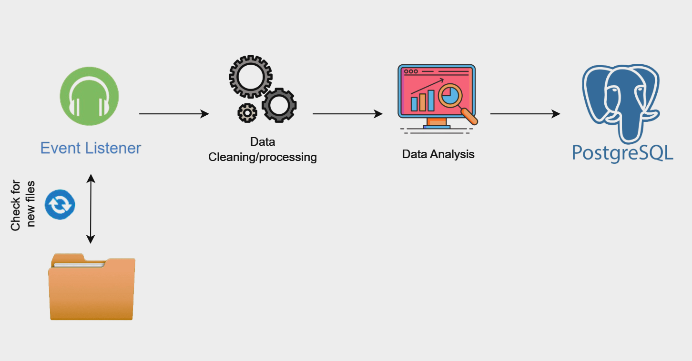

# Real-Time-Data-Pipeline
Design and implement a scalable real-time data pipeline that monitors a directory for incoming data, processes it based on specific criteria, and stores the transformed data in a relational database for further analysis.



## Task Description:
- Data Ingestion & Monitoring:
    - The pipeline should continuously monitor a folder named “data” for incoming CSV files.
    - The files will contain raw sensor data from various sources. These sources will mimic sensor data that is collected periodically, such as temperature, humidity, or pressure readings from different locations.
    - The folder should be monitored regularly (every 5–10 seconds) to detect new files and trigger the processing immediately when new files are detected.
- Data Source:
    - The dataset contains continuous time-series data from multiple sensors, which could include timestamps, sensor ID, location, and multiple measurement values (e.g., temperature, humidity, or pressure).
    - Dataset Source (https://www.kaggle.com/datasets/hmavrodiev/sofia-air-quality-dataset)
- Data Validation and Transformation:
    - Implement validation checks to ensure the incoming data conforms to certain quality standards:
        - No null values in key fields (e.g., sensor ID, timestamp, readings).
        - Correct data types (e.g., numeric values for sensor readings).
        - Acceptable ranges for sensor readings (e.g., temperature between -50°C and 50°C).
    - Any data that fails validation should be moved to a quarantine/ folder, and a detailed error log should be maintained (including the reason for failure).
    - Valid data should be transformed into a standard format, e.g., normalizing the sensor values, parsing dates, or standardizing units of measurement.
- Data Analysis:
    - After validation, calculate aggregated metrics such as the minimum, maximum, average, and standard deviation for each sensor type and data source within the file.
    - Tag the processed data with metadata such as the data source, timestamp, and file name.
    - Store the aggregated data in a structured format for further analysis.
- Database Storage:
    - Design a schema in a relational database (PostgreSQL preferred) to store:
        - The raw sensor data.
        - The aggregated metrics calculated during the data analysis phase.
    - Ensure the schema is optimized for querying and future scalability. Consider indexing, data normalization, and efficient storage for large datasets.
    - Insert the raw data and computed aggregates into their respective tables, with appropriate timestamps.
- Scalability Considerations:
    - While your solution will process a single folder, imagine scaling this pipeline to handle millions of files per day.
    - Provide a brief outline of how you would design the pipeline to scale horizontally. Consider using distributed processing frameworks such as Apache Kafka or Apache Spark, or cloud-based data services such as AWS Lambda or Google Cloud Pub/Sub.
    - Include any optimizations you would implement for high-volume data ingestion and processing.
- Automation & Fault Tolerance:
    - The pipeline should run continuously without manual intervention.
    - If any part of the pipeline fails (e.g., a file is corrupted or the database is unavailable), log the error and attempt recovery without crashing the entire pipeline.
    - Implement a retry mechanism for failed operations, ensuring that no data is lost or ignored during outages or failures.


## How to run
### Pre-Requisites
- Run ```pip3 install requirements.txt```
    > **NOTE:** Installed python3 is expected to test this project
- Download [PostgreSQL](https://www.postgresql.org/download) Database
    - When installing database give password as **"postgres"** or if you are giving another password please update the **password** value in **db_config** in **utils/db_schema.py** and **utils/db_connection_check.py**
    - 💡 **Optional:** [Database Visualizers](https://www.postgresql.org/ftp/pgadmin/pgadmin4/v8.13/)
- Run `python3 db_connect_check.py`
    - To validate if database is up and running

### Trigger Mechanism
- Run ```python3 event_listener.py```
    - To trigger the pipeline
- Add any files from **sample_data** folder to **data** folder
    - This will process the newly added files one by one
    > ⚠️ **NOTE:** Currently its a synchronous process, need to by asynchronous in order to process faster


## Improvements/Noticed Bugs
- Try async functions to process faster - but since csv read/write is there it wont be fully async
- Database - Part of normalization keep seperate table for storing static data such as ["location", "latitude", "longitude"] into another table, so that we can reduce the size on raw data/aggregared metrics
- Code revamp


## Future Works
- Current total processing time is between 30-35 seconds for 70k rows, which can be reduced.
- Use REDIS
    - For logging and storing temporary data, as well as for keeping track of the processing state for each file. This ensures that if a file fails after preprocessing, we don't have to process it from the beginning. Redis can temporarily store the intermediate results (e.g., partially processed data or the state of each record) and allow us to resume the process from the last successful state during a retry. Also if using kafka, to keep track of kafka partition and index value to start process from failed states.
- Use KAFKA
    - Currently, the pipeline processes data sequentially, with dependencies between reading and processing steps. By incorporating Kafka, we can decouple these steps. The producer can continue to produce data (files), while the consumer processes them in parallel (either in a scheduled or real-time manner, depending on requirements). Retension period of 7 days will help keep track of data and re-process if required.
- Use Spark
    - Can be utilized to handle large datasets in a distributed manner, taking advantage of its built-in features for parallel processing.
- Use Elastic Engine
    - Store logs - if we look for millions of files per hour, logs is also going to be high in such cases we cannot rely on redis as querying for logs will also be necessary (eg: query based on certain type of failure in logs, to check how many has failed in each type etc..)
- Extras
    - Grafana
        - For visual representation of logs from elastic index 
    - Containerization (kubernetes)
        - Each component can be released as a docker container and together we can combine multiple components into a helm chart, this will help in cases where major updates on one component happens, only that needs to be changed in a distributed cloud environment (future scaling)  

## References
- https://www.kaggle.com/search
- https://stackoverflow.com
- https://chatgpt.com/
